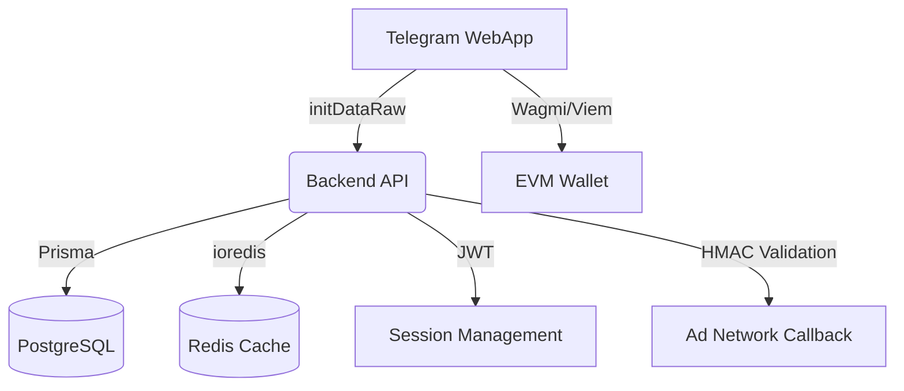

# 🚀 HYIP Mini App - Premium Investment Platform


A high-performance **Watch-to-Earn (W2E)** Idle Miner platform integrated with Telegram Mini Apps (TMA) and EVM wallets (RainbowKit).

## 🏗️ Architecture Overview



## 🚀 Quick Start (Local Dev)

1. **Install Dependencies**:
   ```bash
   npm install
   ```

2. **Setup Environment**:
   - Fill `.env` in `server/` (see `.env.example`)
   - Fill `.env` in `client/`

3. **Run Suite**:
   ```bash
   npm run dev
   ```

## 🛠️ Project Structure

- `client/`: Vite + React + Tailwind + RainbowKit
- `server/`: Node.js + Express + Prisma + Redis

## 📝 Deployment

Deployed via **Vercel** as a monorepo.

- **Frontend**: Managed via `vercel.json` rewrites.
- **Backend**: Serverless functions handling API routes.

---

**Built with Precision for the Next-Gen Investors.**
